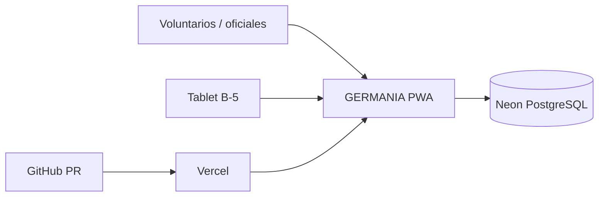

# GERMANIA · Arquitectura vigente (documentación)

**Estado:** descripción de la implementación existente; no autoriza cambios. **Base:** auditoría Claude del 2026-10-08 (main @ 22e5df3), README y revisión parcial de GitHub. Las referencias de líneas pueden cambiar.

## Propósito y límites
Aplicación institucional de la Quinta Compañía Germania de Villarrica. Una sola aplicación, navegación y fuente central de datos. GERMANIA Bridge, ARVIKO y otros proyectos no forman parte de esta arquitectura. Ver [README](README.md) y [criterio operativo](docs/CRITERIO-OPERATIVO.md).

## Contexto (C4 nivel 1)

## Contenedores (C4 nivel 2)
- `app/page.js`: shell Next.js, carga interfaz heredada mediante iframe y vigila versiones.
- `public/legacy/index.html`, `app.js`: interfaz operativa y lógica principal; otros `germania-*.js/css` complementan la interfaz.
- `app/odd-maestras/`: interfaz específica de ODD, distinta de la interfaz heredada.
- `app/api/state/**` y `lib/state-store.js`: persistencia clave/valor y control de versiones en Neon.
- `app/api/guardia/**`: rutas y tablas SQL históricas; **no eliminar ni migrar** sin inventario y ADR aceptado.
- `app/api/auth/officiality/**`: rutas de acceso; riesgos de seguridad registrados por separado.
- `public/sw.js` y `public/manifest.webmanifest`: PWA y política actual de caché.
- `dashboard-preview.html`: vista de estadísticas actual, según auditoría; verificar consumidores antes de cambiar.

## Componentes y dependencias (C4 nivel 3)
| Dominio | Principal implementación | Dependencias relevantes |
| --- | --- | --- |
| Identidad / nómina | `public/legacy/app.js`, `germania-nomina.js` | `roster:v8` |
| Disponibilidad | `app.js`, `germania-fixes-20261002.js` | `disponibilidad:*`, nómina |
| Guardia / OBAC / maquinistas | `app.js`, `germania-roles.js` | `guardia-*`, `guardia:*`, nómina |
| ODD Maestras | `app/odd-maestras/page.js` | API SQL histórica de guardia; **desconexión potencial de dotación vigente** |
| Asistencia / estadísticas | `app.js`, `dashboard-preview.html` | `parte:*`, índices, guardias |
| B-5 / inventario | `app.js`, shell PWA | `inventarioB5:v1`, mantenciones |

## Datos
**Fuente institucional:** Neon, tabla `app_state` (clave, JSON, versión) y mecanismos de historial para determinadas claves. Los índices y registros de `guardia*`, `roster:v8`, `parte:*`, `disponibilidad:*`, `odd:*` tienen reglas diferentes; documentar cada cambio antes de implementarlo. El almacenamiento local no reemplaza la fuente central.

**Deuda documentada:** dos modelos de Guardia (KV vigente y SQL histórico), diferencias entre reglas de completitud y consumidor ODD; decisiones pendientes en ADR 0002 y 0006. **ODD congeladas**, no cambiar sin autorización específica.

## Arranque y rendimiento
Shell con iframe y comprobación de versión; JS heredado grande, fuentes externas y bibliotecas PDF cargadas al inicio. Estadísticas pueden efectuar lecturas individuales numerosas. Impactos reales sobre B-5 no medidos: **no presentar estimaciones como mediciones**.

## Tablet B-5
Lenovo TB-8505X (Tab M8 2.ª gen celular), Android 10, 2 GB RAM, 16 GB, Helio A22, pantalla física 1280×800. Identificador objetivo `B5_TABLET`; **la auditoría indica que aún no está implementada su identificación exclusiva**. Cualquier adaptación debe aislarse del resto de dispositivos. ADR 0004 propuesto.

## Entrega y pruebas
Rama por trabajo → PR → pruebas `npm test` y `npm run build` → revisión independiente → autorización de integración → verificación de Vercel. CI actual ejecuta build; incorporar pruebas es propuesta pendiente, no capacidad ya implementada. Nunca afirmar despliegue sin comprobarlo.

## Seguridad (responsable externo)
**IMPORTANTE:** consultar [registro de riesgos](docs/REGISTRO-RIESGOS-SEGURIDAD.md). Los hallazgos siguen pendientes. Esta documentación no los resuelve ni autoriza modificar controles.

## Decisiones arquitectónicas
Ver [docs/adr/](docs/adr/). ADR en estado **Propuesto** no equivalen a autorización. Actualizar esta arquitectura en el PR que cambie su comportamiento.
